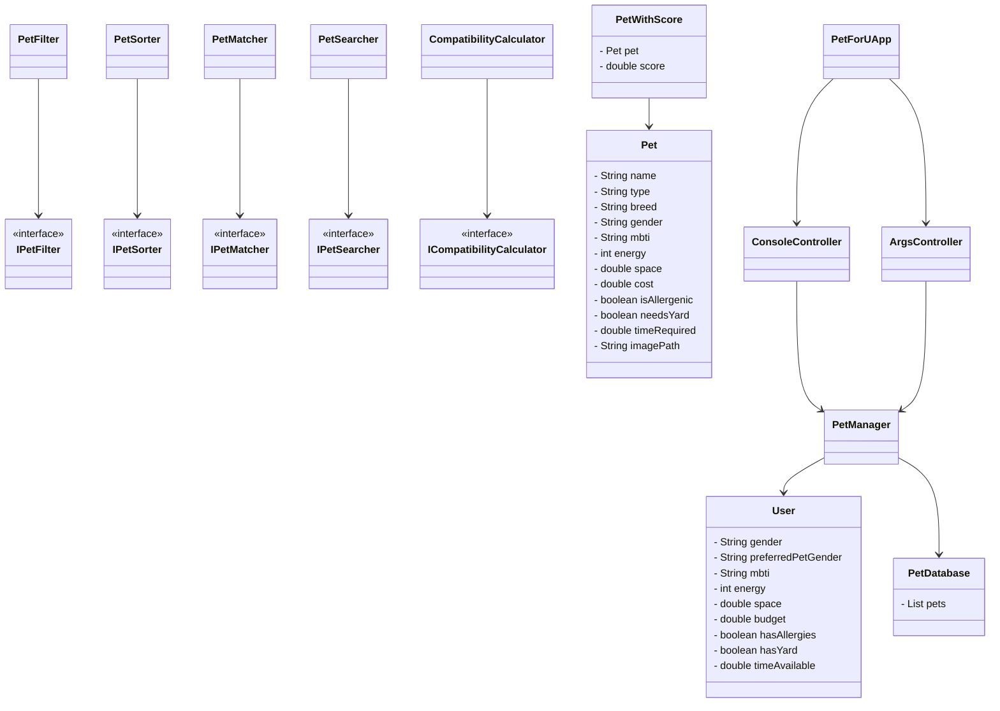

```mermaid
classDiagram

%% Interfaces
class IPetFilter
class IPetSorter
class IPetMatcher
class IPetSearcher
class ICompatibilityCalculator

<<interface>> IPetFilter
<<interface>> IPetSorter
<<interface>> IPetMatcher
<<interface>> IPetSearcher
<<interface>> ICompatibilityCalculator

%% Models
class Pet {
  - String name
  - String type
  - String breed
  - String gender
  - String mbti
  - int energy
  - double space
  - double cost
  - boolean isAllergenic
  - boolean needsYard
  - double timeRequired
  - String imagePath
}

class User {
  - String gender
  - String preferredPetGender
  - String mbti
  - int energy
  - double space
  - double budget
  - boolean hasAllergies
  - boolean hasYard
  - double timeAvailable
}

class PetWithScore {
  - Pet pet
  - double score
}

%% Implementations
class PetFilter
class PetSorter
class PetMatcher
class PetSearcher
class CompatibilityCalculator

PetFilter --> IPetFilter
PetSorter --> IPetSorter
PetMatcher --> IPetMatcher
PetSearcher --> IPetSearcher
CompatibilityCalculator --> ICompatibilityCalculator

%% Controllers
class PetManager
class ConsoleController
class ArgsController

%% Database
class PetDatabase {
  - List<Pet> pets
}

%% Application
class PetForUApp

%% Relationships
PetWithScore --> Pet
PetManager --> User
PetManager --> PetDatabase
ConsoleController --> PetManager
ArgsController --> PetManager
PetForUApp --> ConsoleController
PetForUApp --> ArgsController
```
