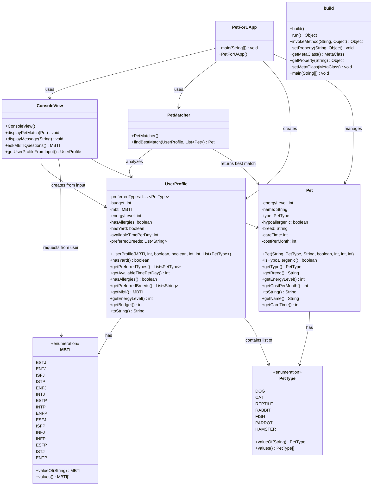

```mermaid
classDiagram
    %% Main Application
    class PetForUApp {
        +main(String[]) void
        +PetForUApp()
    }

    %% Enumerations
    class MBTI {
        <<enumeration>>
        ESTJ
        ENTJ
        ISFJ
        ISTP
        ENFJ
        INTJ
        ESTP
        INTP
        ENFP
        ESFJ
        ISFP
        INFJ
        INFP
        ESFP
        ISTJ
        ENTP
        +valueOf(String) MBTI
        +values() MBTI[]
    }

    class PetType {
        <<enumeration>>
        DOG
        CAT
        REPTILE
        RABBIT
        FISH
        PARROT
        HAMSTER
        +valueOf(String) PetType
        +values() PetType[]
    }

    %% Model Classes
    class UserProfile {
        -preferredTypes: List~PetType~
        -budget: int
        -mbti: MBTI
        -energyLevel: int
        -hasAllergies: boolean
        -hasYard: boolean
        -availableTimePerDay: int
        -preferredBreeds: List~String~
        +UserProfile(MBTI, int, boolean, boolean, int, int, List~PetType~)
        +hasYard() boolean
        +getPreferredTypes() List~PetType~
        +getAvailableTimePerDay() int
        +hasAllergies() boolean
        +getPreferredBreeds() List~String~
        +getMbti() MBTI
        +getEnergyLevel() int
        +getBudget() int
        +toString() String
    }

    class Pet {
        -energyLevel: int
        -name: String
        -type: PetType
        -hypoallergenic: boolean
        -breed: String
        -careTime: int
        -costPerMonth: int
        +Pet(String, PetType, String, boolean, int, int, int)
        +isHypoallergenic() boolean
        +getType() PetType
        +getBreed() String
        +getEnergyLevel() int
        +getCostPerMonth() int
        +toString() String
        +getName() String
        +getCareTime() int
    }

    %% Controller Classes
    class PetMatcher {
        +PetMatcher()
        +findBestMatch(UserProfile, List~Pet~) Pet
    }

    class ConsoleView {
        +ConsoleView()
        +displayPetMatch(Pet) void
        +displayMessage(String) void
        +askMBTIQuestions() MBTI
        +getUserProfileFromInput() UserProfile
    }

    class build {
        +build()
        +run() Object
        +invokeMethod(String, Object) Object
        +setProperty(String, Object) void
        +getMetaClass() MetaClass
        +getProperty(String) Object
        +setMetaClass(MetaClass) void
        +main(String[]) void
    }

    %% Relationships
    PetForUApp --> ConsoleView: uses
    PetForUApp --> PetMatcher: uses
    PetForUApp --> UserProfile: creates
    PetForUApp --> Pet: manages

    UserProfile --> MBTI: has
    UserProfile --> PetType: contains list of

    Pet --> PetType: has

    ConsoleView --> UserProfile: creates from input
    ConsoleView --> MBTI: requests from user
    ConsoleView --> Pet: displays

    PetMatcher --> UserProfile: analyzes
    PetMatcher --> Pet: returns best match
```