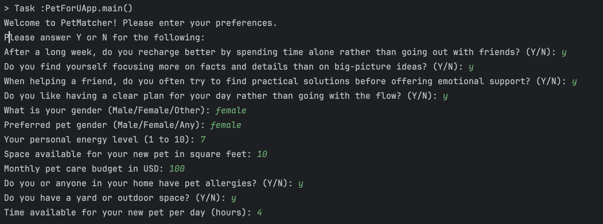
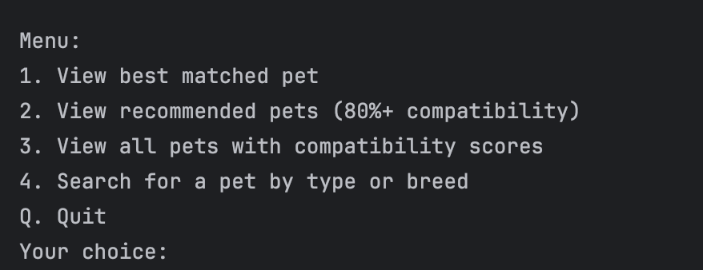
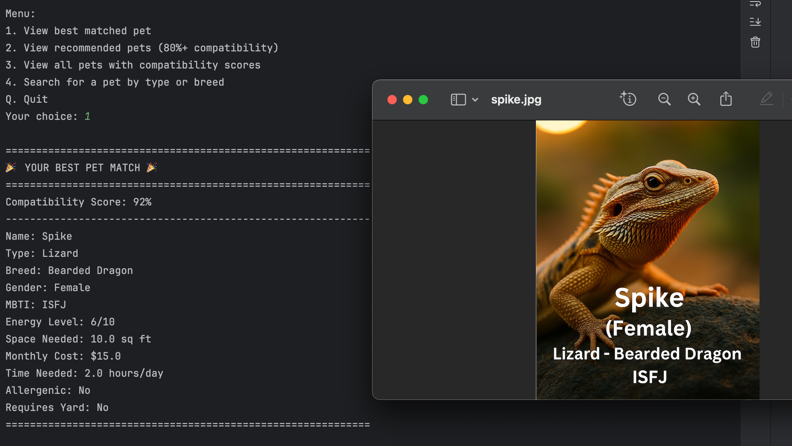
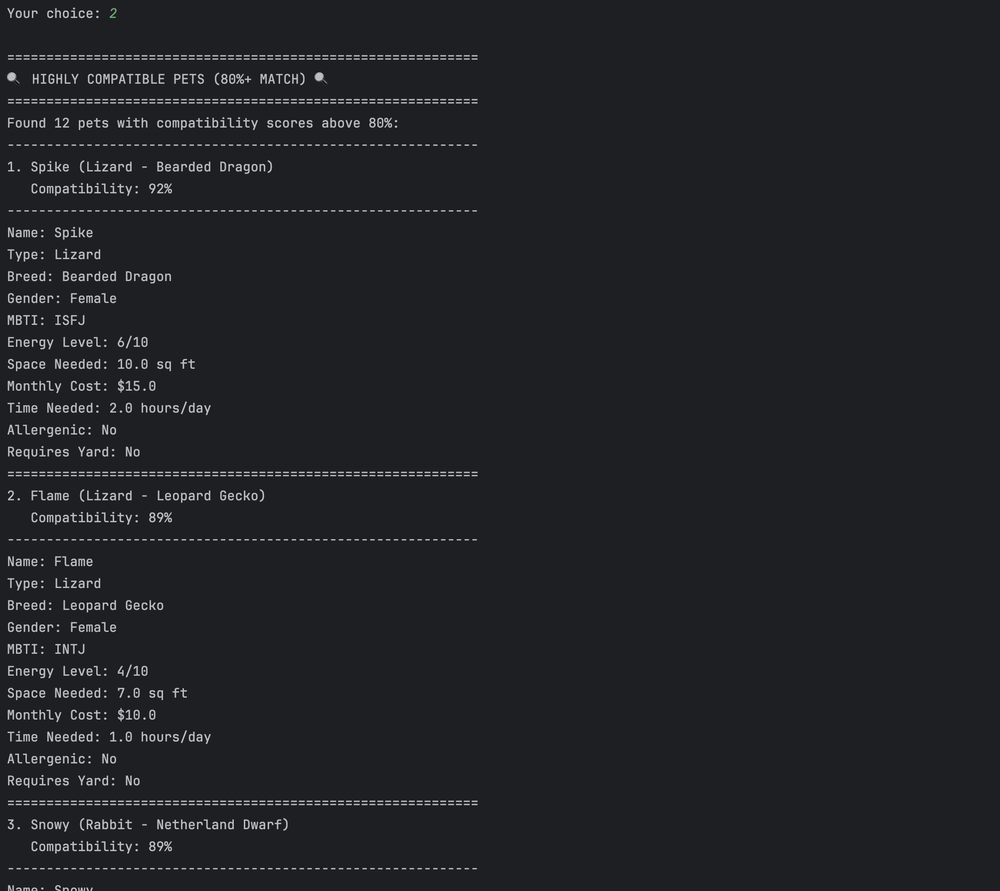
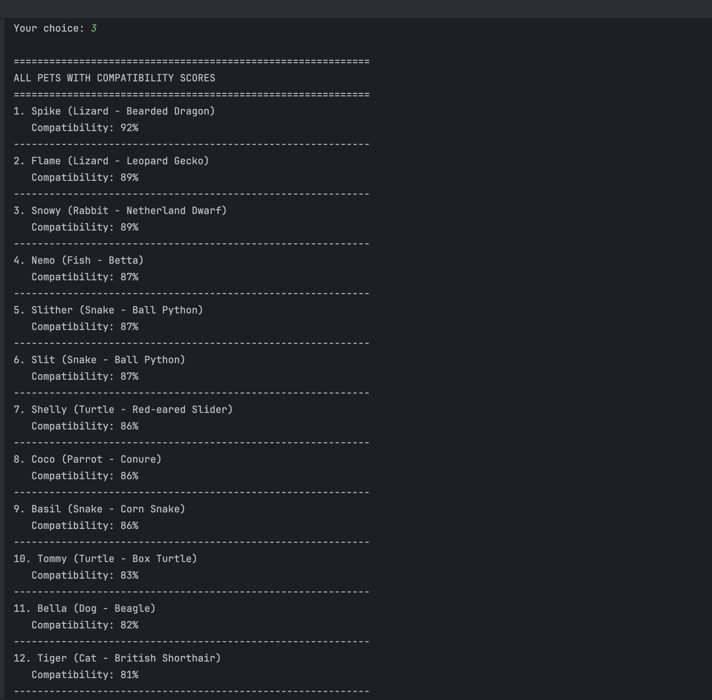
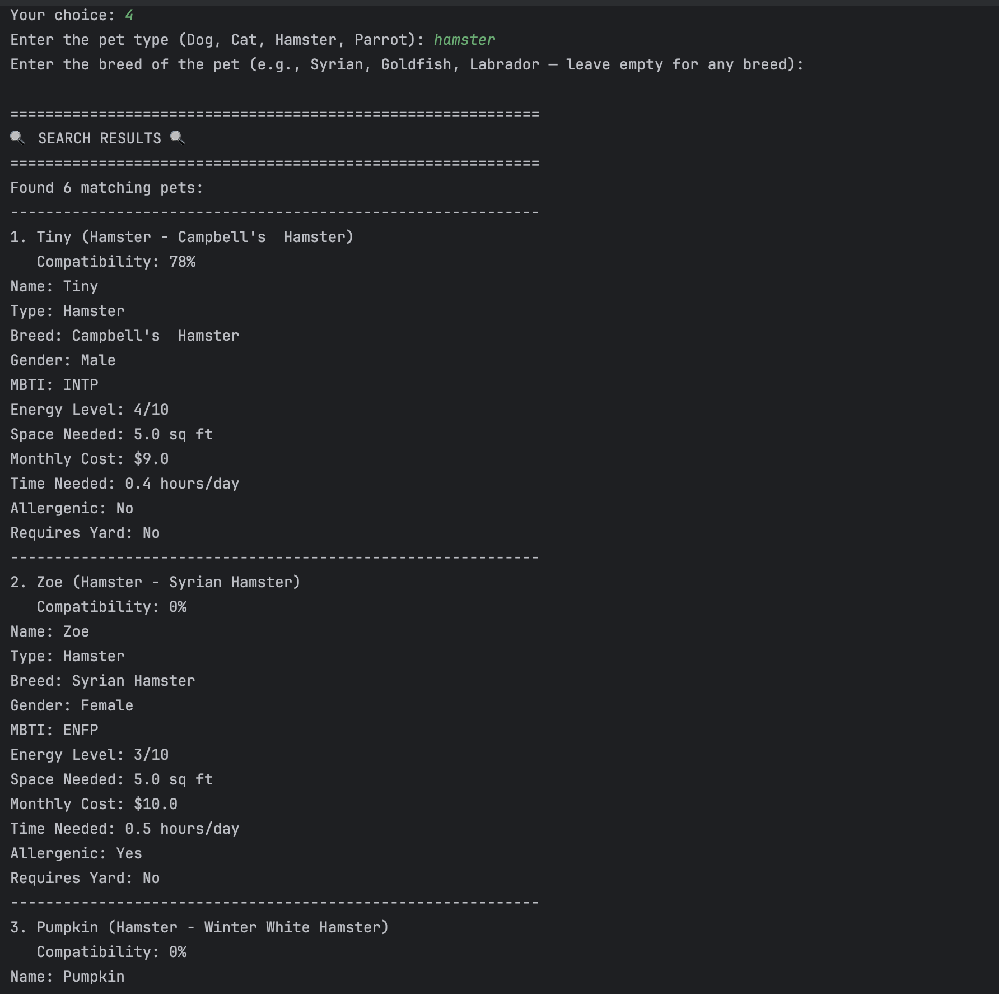

# Manual 

### Introduction
PetForU is an application designed to match users with compatible pets based on personal preferences, lifestyle, and compatibility factors. This guide will walk you through using the application to find your perfect pet companion.

### Getting Started
After launching the application, you'll be greeted with a series of questions to assess your preferences and lifestyle. These questions help the system determine which pets would be most compatible with you.

### Input Questions
The application will ask you about:

1. **Personality Questions (MBTI Assessment)**
   - These questions determine your personality type, which helps match you with pets that have compatible temperaments
   
2. **Personal Information**
   - Gender and pet gender preference
   - Energy level (scale 1-10)
   - Available living space (in square feet)
   - Monthly budget for pet care (in USD)
   - Allergy considerations
   - Yard availability
   - Daily time available for pet care (in hours)

### Main Menu
After providing your information, you'll see the main menu with these options:

1. **View best matched pet** - Shows the single most compatible pet based on your profile
2. **View recommended pets** - Displays all pets with compatibility scores above 80%
3. **View all pets with compatibility scores** - Lists all available pets with their compatibility scores
4. **Search for a pet by type or breed** - Allows filtering pets by type (dog, cat, etc.) and/or breed
5. **Quit** - Exits the application

### Feature 1: Best Match
When selecting option 1, the application will:
- Display the pet with the highest compatibility score
- Show detailed information about the pet (name, type, breed, etc.)
- Present the compatibility score as a percentage
- Open an image of the pet in your default image viewer

If no pets have a compatibility score above 80%, the system will inform you that now might not be the best time for pet ownership based on your current situation.

### Feature 2: Recommended Pets
When selecting option 2, the application will:
- Display all pets with compatibility scores above 80%
- Show each pet's information and score
- Open images of each pet in your default image viewer

### Feature 3: All Pets with Scores
When selecting option 3, the application will:
- Display all pets in the database with their compatibility scores
- Present the information in a list format
- Note: This option doesn't automatically open pet images

### Feature 4: Search Function
When selecting option 4, the application will:
- Prompt you to enter a pet type (e.g., Dog, Cat, Hamster)
- Optionally, you can specify a breed for more focused results
- Display all matching pets with their compatibility scores
- Open images of each matching pet in your default image viewer

### Compatibility Factors
The application calculates compatibility based on several factors:
- Space requirements vs. your available space
- Time needs vs. your available time
- Budget requirements vs. your available budget
- Energy level compatibility
- MBTI personality matching
- Allergy considerations
- Yard requirements

### Note on Images
Pet images are stored locally in the `screenshots` folder. If an image cannot be displayed, you'll see an error message, but the application will continue to function.